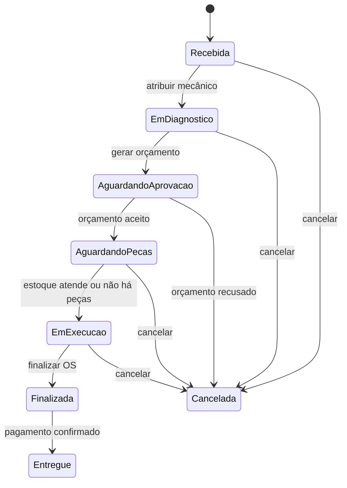

# Linguagem Ubíqua - Oficina Mecânica

Documento de vocabulário do domínio, estruturado para publicação na Wiki do
projeto. As convenções de código que derivam dele, e o resto da documentação
técnica, estão em [guia-tecnico.md](guia-tecnico.md).

## 1. Objetivo

Este documento consolida a linguagem comum do Sistema Integrado de Atendimento e Execução de Serviços de uma oficina mecânica. O vocabulário deve ser utilizado por negócio, produto, arquitetura, desenvolvimento, testes e documentação da API.

A linguagem de negócio é mantida em português. O código utiliza nomes em inglês; por isso, o mapeamento entre o termo de negócio e o identificador técnico é explícito neste documento.

Fontes analisadas:

- documentação de Event Storming, modelo de domínio e Context Map;
- projeto `oficina-fiap-api`;
- entidades, estados, serviços, controladores, banco de dados e documentação do projeto.

## 2. Visão de negócio

O atendimento começa quando um **Cliente** e seu **Veículo** são identificados. Um **Atendente** abre uma **Ordem de Serviço (OS)**, inicialmente com status **Recebida**. A OS é atribuída a um **Mecânico**, que inicia o diagnóstico e registra o resultado.

Com o diagnóstico concluído, a oficina gera um **Orçamento** com serviços e, quando necessário, peças. O orçamento é enviado ao cliente e aguarda aprovação. Quando aprovado, as peças e os insumos são solicitados ao **Estoque**. Se houver disponibilidade, o estoque é baixado e a OS entra em execução. Se houver falta, é registrada uma **Necessidade de Compra**, que origina um **Pedido de Compra**.

Após o recebimento do pedido, o estoque é atualizado. Quando todas as peças necessárias são atendidas, a OS pode seguir para execução. Ao terminar o reparo, a OS é finalizada. Em seguida, é criada uma **Cobrança** com base no orçamento aprovado mais recente. O cliente recebe um **Link de Pagamento**; o **Gateway de Pagamento** confirma ou não o pagamento. Somente após a confirmação a OS pode ser entregue ao cliente.

## 3. Termos canônicos

| Termo canônico | Definição no domínio | Identificador no código | Não confundir com |
|---|---|---|---|
| Cliente | Pessoa física ou jurídica que solicita o atendimento e é responsável pelo veículo e pela aprovação do orçamento. | `Client` | usuário autenticado ou mecânico |
| Documento | CPF ou CNPJ do cliente, validado e persistido sem máscara. | `CpfCnpj` / `document` | número da OS |
| Veículo | Automóvel vinculado a um cliente, identificado por sua placa. | `Vehicle` | peça ou item de estoque |
| Placa | Identificador do veículo, nos formatos antigo ou Mercosul, normalizado. | `Plate` / `plate` | código da peça |
| Ordem de Serviço (OS) | Registro do atendimento de um cliente para um veículo, com diagnóstico, execução e acompanhamento de status. | `ServiceOrder` | pedido de compra |
| Mecânico | Ator responsável pela execução do diagnóstico e do serviço. | `mechanicId` | usuário autenticado; no código é armazenado apenas o identificador |
| Atendente | Ator que realiza cadastro, abertura e acompanhamento administrativo da OS. | `ADMIN` ou `EMPLOYEE` | cliente |
| Diagnóstico | Avaliação técnica do veículo que orienta os serviços e as peças do orçamento. | conceito do domínio; ainda não há agregado próprio | orçamento |
| Orçamento | Proposta de serviços e peças, vinculada a uma OS, com total calculado e resposta do cliente. | `Budget` | cobrança |
| Versão do orçamento | Número sequencial de uma nova proposta para a mesma OS. | `version` | revisão técnica sem nova proposta |
| Item de orçamento | Serviço ou peça/insumo que compõe o orçamento. | `BudgetItem` | item do pedido de compra |
| Serviço | Trabalho executado pela oficina e cobrado no orçamento; não é baixado do estoque. | `BudgetItemType.SERVICE` | ordem de serviço inteira |
| Peça e insumo | Material necessário para executar o serviço e que pode ser controlado pelo estoque. | `Part`, `PartType.PART` ou `PartType.SUPPLY` | item de serviço |
| Estoque | Conjunto de peças e insumos disponíveis para atender OS e registrar reposições. | módulo `stock` | almoxarifado externo |
| Disponibilidade | Quantidade existente de uma peça ou insumo em relação à quantidade necessária. | `hasAvailability` | orçamento aprovado |
| Movimentação de estoque | Entrada ou saída registrada para alterar a quantidade disponível. | `StockMovement`, `IN` ou `OUT` | pedido de compra |
| Necessidade de compra | Situação em que a quantidade disponível não atende a necessidade da OS. | `registerShortage` | compra já realizada |
| Pedido de Compra | Solicitação de reposição feita a um fornecedor, com seus itens e quantidades. | `PurchaseOrder` | ordem de serviço |
| Item do pedido de compra | Peça, quantidade e preço unitário copiado no momento da compra. | `PurchaseOrderItem` | item de orçamento |
| Cobrança | Valor a receber pela OS finalizada, originado do orçamento aprovado. | `Billing` | pagamento ou link de pagamento |
| Pagamento | Confirmação de que a cobrança foi quitada, normalmente recebida pelo gateway. | dados de pagamento dentro de `Billing` | cobrança pendente |
| Gateway de Pagamento | Sistema externo responsável por criar o link e informar o resultado do pagamento. | `PaymentGateway` / Stripe | notificação por e-mail |
| Link de Pagamento | Endereço gerado pelo gateway para o cliente pagar a cobrança. | `paymentLink` | confirmação de pagamento |
| Multa | Valor adicional calculado quando o link de pagamento expira e há atraso. | `Penalty` | desconto ou taxa de serviço |
| Notificação | Registro e tentativa de envio de um aviso por e-mail. | `Notification` | evento de domínio |

## 4. Contextos delimitados

### 4.1 Atendimento

**Classificação:** domínio auxiliar.

Responsável pelos dados cadastrais de clientes e veículos.

Termos principais:

- Cliente;
- Documento;
- E-mail;
- Telefone;
- Veículo;
- Placa;
- Marca, modelo e ano.

Responsabilidades:

- cadastrar, consultar, atualizar e excluir clientes;
- cadastrar, consultar, atualizar e excluir veículos;
- garantir que o veículo pertença ao cliente informado;
- fornecer `ClientId` e `VehicleId` para o contexto de Gestão de Ordem de Serviço.

### 4.2 Gestão de Ordem de Serviço

**Classificação:** domínio principal.

É o contexto central do negócio. Coordena a jornada da OS, do recebimento à entrega, incluindo diagnóstico, orçamento, aprovação, execução e acompanhamento.

Termos principais:

- Ordem de Serviço;
- Diagnóstico;
- Mecânico;
- Orçamento;
- Aprovação e recusa;
- Execução;
- Finalização;
- Entrega.

Este contexto consulta o Atendimento, solicita disponibilidade e baixa ao Estoque e Compras, e solicita cobrança ao contexto de Pagamentos.

### 4.3 Estoque e Compras

**Classificação:** domínio auxiliar.

Responsável por peças, insumos, disponibilidade, entradas, saídas e reposição.

Termos principais:

- Peça e insumo;
- Quantidade disponível;
- Movimentação de estoque;
- Entrada;
- Saída;
- Necessidade de compra;
- Pedido de Compra;
- Entrega do pedido.

Uma baixa de estoque para uma OS deve ser idempotente: repetir a mesma solicitação não pode retirar a mesma peça duas vezes.

### 4.4 Pagamentos

**Classificação:** domínio genérico.

Responsável por cobrança, link de pagamento, confirmação de pagamento, expiração e multa.

Termos principais:

- Cobrança;
- Valor da cobrança;
- Link de Pagamento;
- Gateway de Pagamento;
- Pagamento registrado;
- Cobrança expirada;
- Multa.

Uma cobrança só pode ser criada para uma OS finalizada e deve utilizar o orçamento aprovado mais recente.

### 4.5 Autenticação e Acesso

**Classificação:** domínio genérico.

Responsável por usuários, credenciais, perfis, permissões, tokens e sessões de atualização.

Termos principais:

- Usuário;
- Credencial;
- Administrador;
- Funcionário;
- Access token;
- Refresh token;
- Sessão de atualização.

Este contexto autentica e autoriza as operações administrativas dos demais contextos.

### 4.6 Notificações

No Context Map original, a notificação aparece como capacidade de apoio associada aos demais contextos. No código ela existe como módulo próprio e transversal.

Tipos implementados:

- orçamento pronto para aprovação (`BUDGET_READY`);
- link de pagamento disponível (`PAYMENT_LINK_READY`);
- peças e insumos solicitados (`STOCK_PARTS_REQUESTED`).

Falha no envio não desfaz a operação de negócio. A notificação fica registrada como `FAILED` e pode ser reenviada por um operador.

## 5. Agregados e limites de consistência

| Agregado | Raiz | Conteúdo principal | Invariantes relevantes |
|---|---|---|---|
| Cliente | `Client` | dados cadastrais e VOs `CpfCnpj` e `Email` | documento e e-mail únicos; telefone válido; documento imutável |
| Veículo | `Vehicle` | veículo e VOs `Plate` e `ModelYear` | placa e cliente obrigatórios; placa e proprietário imutáveis |
| Ordem de Serviço | `ServiceOrder` | cliente, veículo, descrição, mecânico, status e marcos de execução | transições válidas; mecânico obrigatório para execução; motivo obrigatório ao cancelar |
| Orçamento | `Budget` | versão, itens, total e resposta do cliente | pelo menos um item; item de peça pode referenciar estoque; só orçamento gerado pode ser editado |
| Estoque | `Part` | peça/insumo, preço, quantidade e quantidade mínima | quantidade não pode ficar negativa; entrada/saída positiva; baixa idempotente |
| Pedido de Compra | `PurchaseOrder` | fornecedor, número, status e `PurchaseOrderItem` | pedido deve ter itens para registrar compra; itens não mudam após registro |
| Cobrança | `Billing` | OS, orçamento, valor, link, transação, status e pagamento | valor positivo; pagamento idempotente; cobrança paga é terminal |

### Relações entre agregados

- Cliente possui zero ou mais Veículos.
- Cliente e Veículo são referências obrigatórias de uma Ordem de Serviço.
- Uma Ordem de Serviço pode possuir várias versões de Orçamento.
- Um Orçamento possui um ou mais Itens de Orçamento.
- Itens de Orçamento do tipo peça podem referenciar uma Peça do Estoque.
- Um Pedido de Compra possui um ou mais Itens do Pedido.
- Uma Cobrança referencia uma OS e o Orçamento que fundamentou o valor.
- A OS não incorpora os demais agregados; utiliza seus identificadores e serviços de aplicação.

## 6. Comandos e eventos de negócio

Os comandos representam intenção. Os eventos representam fatos já ocorridos e devem ser nomeados no passado. Os diagramas usam esses conceitos explicitamente; a implementação atual orquestra as ações por serviços e controladores, sem um barramento de eventos de domínio.

### 6.1 Atendimento

| Comando | Evento resultante |
|---|---|
| Consultar cliente | Cliente encontrado ou Cliente não encontrado |
| Cadastrar cliente | Cliente cadastrado |
| Consultar veículo | Veículo encontrado ou Veículo não encontrado |
| Cadastrar veículo | Veículo cadastrado |

### 6.2 Ordem de Serviço e Orçamento

| Comando | Evento resultante |
|---|---|
| Criar Ordem de Serviço | Ordem de Serviço criada com status Recebida |
| Atribuir OS ao mecânico | OS atribuída ao mecânico; diagnóstico iniciado |
| Finalizar diagnóstico | Diagnóstico realizado; diagnóstico registrado |
| Gerar orçamento | Orçamento gerado |
| Enviar orçamento ao cliente | Orçamento aguardando aprovação; notificação de orçamento enviada |
| Aceitar orçamento | Orçamento aceito; peças solicitadas |
| Recusar orçamento | Orçamento recusado; Ordem de Serviço cancelada |
| Consultar OS | Status atual da Ordem de Serviço consultado |
| Cancelar OS | Ordem de Serviço cancelada |
| Finalizar OS | Ordem de Serviço finalizada |

### 6.3 Estoque e Compras

| Comando | Evento resultante |
|---|---|
| Consultar disponibilidade das peças | Peças e insumos disponíveis ou Peças e insumos indisponíveis |
| Baixar peças para a OS | Movimentação de saída registrada; estoque atualizado |
| Registrar necessidade de compra | Necessidade de compra identificada; Pedido de Compra registrado |
| Registrar compra | Pedido de Compra aguardando entrega |
| Registrar entrega do pedido | Pedido de Compra recebido; movimentação de entrada registrada; estoque atualizado |
| Reprocessar despacho da OS | Peças despachadas ou nova necessidade de compra identificada |

### 6.4 Pagamentos e notificações

| Comando | Evento resultante |
|---|---|
| Gerar cobrança | Cobrança gerada |
| Gerar ou renovar link | Link de pagamento disponibilizado |
| Registrar pagamento | Pagamento registrado |
| Expirar cobrança | Cobrança expirada; multa calculável |
| Entregar OS após pagamento | Ordem de Serviço entregue |
| Enviar notificação | Cliente ou estoque notificado |
| Reenviar notificação com falha | Notificação reenviada ou falha novamente registrada |

## 7. Estados do domínio

### 7.1 Ordem de Serviço

Estados técnicos:

| Estado de negócio | Enum |
|---|---|
| Recebida | `RECEIVED` |
| Em diagnóstico | `IN_DIAGNOSIS` |
| Aguardando aprovação | `AWAITING_APPROVAL` |
| Aguardando peças | `AWAITING_PARTS` |
| Em execução | `IN_PROGRESS` |
| Finalizada | `COMPLETED` |
| Entregue | `DELIVERED` |
| Cancelada | `CANCELLED` |

O tempo médio de execução é medido da atribuição ao mecânico (`assignedAt`) até a finalização (`completedAt`), e não da abertura da OS.

### 7.2 Orçamento

`GERADO` (`GENERATED`) -> `AGUARDANDO_APROVAÇÃO` (`WAITING_APPROVAL`) -> `ACEITO` (`ACCEPTED`) ou `RECUSADO` (`REFUSED`).

Somente o orçamento em estado `GERADO` pode receber ou remover itens. Somente o orçamento em `AGUARDANDO_APROVAÇÃO` pode ser aceito ou recusado. A recusa exige motivo.

### 7.3 Cobrança

`PENDENTE` (`PENDING`) -> `AGUARDANDO_PAGAMENTO` (`WAITING_PAYMENT`) -> `PAGA` (`PAID`).

Uma cobrança `PENDENTE` ou `AGUARDANDO_PAGAMENTO` pode tornar-se `EXPIRADA` (`EXPIRED`). Uma cobrança paga é terminal. O pagamento deve ser idempotente para a mesma transação do gateway.

### 7.4 Pedido de Compra

`NECESSITA_COMPRA` (`NEEDS_PURCHASE`) -> `AGUARDANDO_ENTREGA` (`AWAITING_DELIVERY`) -> `ENTREGUE` (`DELIVERED`).

Quando o pedido é entregue, cada item gera uma entrada no estoque. A entrada utiliza chave de idempotência derivada do pedido e do item.

### 7.5 Notificação

`PENDENTE` (`PENDING`) -> `ENVIADA` (`SENT`) ou `FALHOU` (`FAILED`). Somente uma notificação que falhou pode ser reenviada explicitamente.

## 8. Regras de negócio

1. Uma OS deve referenciar um cliente existente e um veículo pertencente a esse cliente.
2. Ao atribuir uma OS, o status passa para `Em diagnóstico`, o mecânico é registrado e o cronômetro é iniciado.
3. Um mecânico não pode possuir outra OS aberta simultaneamente.
4. Uma OS só entra em `Em execução` depois que o estoque registra o atendimento das peças. A exceção é um orçamento composto somente por serviços, que não exige baixa de estoque.
5. O orçamento deve conter pelo menos um item e seu total é calculado pelo sistema.
6. Uma peça de orçamento deve referenciar uma peça do estoque; um serviço não deve referenciar uma peça.
7. Quando o primeiro orçamento é gerado, a OS passa a `Aguardando aprovação` e o cliente é notificado.
8. Quando o cliente aceita o orçamento, a OS passa a `Aguardando peças` e o estoque é notificado.
9. Quando o cliente recusa o orçamento, a OS é cancelada com o motivo da recusa.
10. Para o estoque e para a cobrança, vale o orçamento aceito de maior versão.
11. Se a disponibilidade for insuficiente, o sistema deve registrar a necessidade de compra com a diferença necessária.
12. O estoque só é atualizado com entrada após o pedido de compra ser registrado como entregue.
13. Uma cobrança só pode ser criada para uma OS finalizada e com orçamento aceito.
14. O valor da cobrança é o total do orçamento aceito; o cliente não informa um total calculado manualmente.
15. A OS só pode ser entregue após a cobrança estar paga.
16. Falhas de e-mail não revertem orçamento, aprovação, baixa de estoque, cobrança ou pagamento.
17. Quantidades de movimentação de estoque devem ser inteiras e positivas.
18. A quantidade disponível de uma peça não pode ficar negativa.
19. Uma peça precisa ser reposta quando sua quantidade for menor ou igual à quantidade mínima configurada.
20. CPF/CNPJ, e-mail, placa, código da peça, número do pedido e identificadores de transação devem respeitar as regras de unicidade do sistema.

## 9. Value Objects e conceitos imutáveis

| Conceito | Regra |
|---|---|
| `CpfCnpj` | valida CPF ou CNPJ e normaliza para somente dígitos |
| `Email` | valida e normaliza para minúsculas |
| `Plate` | valida placa antiga ou Mercosul e normaliza o formato |
| `ModelYear` | aceita ano entre 1900 e o ano seguinte ao atual |
| `PartCode` | identifica unicamente uma peça ou insumo |
| `Quantity` | representa quantidade positiva; o estoque trabalha com inteiros |
| `Money` | representa valores monetários em centavos, evitando cálculo monetário em ponto flutuante |
| `PurchaseOrderNumber` | identifica o pedido, no formato sequencial anual, por exemplo `PC-2026-0001` |
| `Penalty` | calcula o valor adicional de uma cobrança vencida |

## 10. Mapeamento entre contexto, módulo e API

O prefixo de API nomeia o **agregado**, sempre no plural. Ele não repete o nome
do contexto: por isso o recurso de peça é `/api/v1/parts`, e não `/api/v1/stock`
— Estoque é o contexto, Peça é o agregado (§12.3).

| Contexto | Módulo | Agregado/entidade principal | Prefixo de API |
|---|---|---|---|
| Atendimento | `client` | `Client` | `/api/v1/clients` |
| Atendimento | `vehicle` | `Vehicle` | `/api/v1/vehicles` |
| Gestão de OS | `service-order` | `ServiceOrder` | `/api/v1/service-orders` |
| Gestão de OS | `budget` | `Budget` | `/api/v1/budgets` |
| Gestão de OS | `service-catalog` | `Service` | `/api/v1/services` |
| Estoque e Compras | `stock` | `Part` e `StockMovement` | `/api/v1/parts` |
| Estoque e Compras | `purchase-order` | `PurchaseOrder` | `/api/v1/purchase-orders` |
| Pagamentos | `billing` | `Billing` | `/api/v1/billings` |
| Autenticação e Acesso | `auth` e `shared/identity` | `User` e `RefreshSession` | `/api/v1/auth` |
| Notificações | `notification` | `Notification` | `/api/v1/notifications` |

A entrada e a saída de estoque são **Movimentação de estoque**, não um recurso
"stock" dentro da peça: `POST /api/v1/parts/:id/movements/in` e
`POST /api/v1/parts/:id/movements/out`.

## 11. Regras de nomenclatura

- Usar **Ordem de Serviço** na primeira ocorrência e **OS** nas seguintes.
- Usar **Pedido de Compra** sempre que o assunto for reposição junto ao fornecedor. Evitar o termo isolado “pedido”.
- Usar **Orçamento** para a proposta aprovada ou recusada; usar **Cobrança** para o valor a receber depois da finalização da OS.
- Usar **Pagamento** somente para a confirmação da quitação. O link é um meio de pagamento, não o pagamento em si.
- Usar **Peça e insumo** no contexto de estoque e **Item de orçamento** quando o material estiver compondo uma proposta.
- Usar os estados no idioma do negócio: `Recebida`, `Em diagnóstico`, `Aguardando aprovação`, `Aguardando peças`, `Em execução`, `Finalizada`, `Entregue`, `Cancelada`.
- Eventos devem usar particípio ou fato concluído: `Orçamento gerado`, `Pagamento registrado`, `Estoque atualizado`.
- Comandos devem usar infinitivo e intenção: `Gerar orçamento`, `Aceitar orçamento`, `Registrar pagamento`.
- O identificador técnico em inglês deve manter correspondência estável com o termo de negócio, sem criar sinônimos para a mesma ideia.
- Não misturar os dois idiomas dentro de um mesmo identificador. `getPecaId` num agregado chamado `PurchaseOrderItem` é o caso a evitar; o correto é `getPartId`.
- **Cliente é `Client`.** Não usar `Customer` como sinônimo — nem em método (`sendToClient`, não `sendToCustomer`), nem em exemplo de Swagger.
- Toda mensagem de negócio — `DomainException`, exceção HTTP, `summary` e `description` de Swagger — é escrita em português, porque é texto de negócio. Só o identificador é inglês.
- Prefixo de API no plural, e o `@ApiTags` do controller repete exatamente o prefixo.
- Value Object mora em `value-objects/` com o sufixo `.vo.ts`; enum mora em `enums/` com o sufixo `.enum.ts`, nunca dentro da entidade ou do repositório.
- Um conceito, uma classe. Se dois módulos precisam do mesmo VO, ele sobe para `shared/domain/value-objects/` em vez de ser duplicado.

## 12. Conciliações entre documentação e implementação

### 12.1 Termos desenhados, mas ainda não separados no código

O modelo conceitual apresenta `Diagnóstico` e `ItemOrdemServico` como entidades da OS. Na implementação atual, o diagnóstico ainda não possui entidade, campo ou caso de uso próprio; a OS mantém uma descrição e os itens de serviço ficam representados como `BudgetItem`. Portanto, o termo canônico continua sendo **Diagnóstico**, mas sua modelagem detalhada é uma evolução futura.

### 12.2 Pagamento dentro da cobrança

O desenho conceitual apresenta `Pagamento` relacionado à `Cobrança`. No código, os dados essenciais do pagamento (`paymentMethod`, `paidAt` e identificador da transação) são mantidos dentro do agregado `Billing`, enquanto as sessões do checkout são registradas separadamente. O termo de negócio não muda: o fato é **Pagamento registrado**.

### 12.3 Estoque e movimentação

No modelo conceitual, `MovimentaçãoEstoque` aparece próxima ao agregado Estoque. No código, `Part` é a entidade rica responsável pela quantidade, e `StockMovement` é persistido pelo serviço de movimentação. A distinção recomendada é: **Estoque** é o contexto; **Peça** é o agregado operacional; **Movimentação de estoque** é o registro da entrada ou saída.

### 12.4 Agregados implementados

Uma versão do README enumera Cliente, Veículo, OS, Orçamento e Estoque como agregados. O projeto atual também implementa os agregados **Pedido de Compra** e **Cobrança**, além dos módulos transversais de autenticação e notificação. Este documento considera os sete agregados de negócio efetivamente presentes no código.

### 12.5 Eventos conceituais e eventos técnicos

Os cartões amarelos do Event Storming expressam fatos de negócio. Atualmente, eles são realizados por chamadas síncronas entre serviços/controladores e por notificações registradas. Não há, no código analisado, uma infraestrutura geral de publicação e consumo de eventos de domínio. Caso ela seja adicionada, os nomes deste documento devem ser reaproveitados nos contratos dos eventos.

## 12.6 Dinheiro e quantidade

Todo valor monetário é `Money` dentro do domínio — inclusive no `Budget`, que
antes calculava centavos na mão. As três formas do mesmo valor ficam em
fronteiras separadas e não se misturam:

| Camada | Forma | Onde converte |
|---|---|---|
| Contrato HTTP (DTO) | decimal (`149.90`) | JSON não tem tipo monetário |
| Domínio | `Money` | serviço de aplicação, na entrada |
| Banco | centavos inteiros (`*Cents`) | mapper/repositório, na saída |

Um DTO com `unitPrice: number` está correto: é a fronteira. O que não pode é o
agregado guardar `number`.

`Quantity` é um VO único em `shared/domain/value-objects`, com dois
construtores nomeados, porque o domínio tem duas invariantes:

- `Quantity.create` — **saldo** de estoque, pode ser zero (regra 18);
- `Quantity.positive` — **movimento**, entrada, saída ou item, tem que ser maior que zero (regra 17).

A quantidade do item de orçamento é a única que não usa o VO: ela é decimal de
propósito, porque o item pode ser medido em litro ou quilo (2,5 L de óleo).

## 13. Decisões pendentes recomendadas

> As decisões abaixo seguem em aberto. As que **já foram resolvidas** e saíram
> desta lista: a unificação do VO `Quantity`, a adoção de `Money` no `Budget`, a
> nomenclatura das rotas e a chave estrangeira de `Budget` para `ServiceOrder`.

1. Definir se `Diagnóstico` será uma entidade própria da OS ou se continuará sendo um conceito representado pela descrição e pelos itens do orçamento.
2. Definir o tratamento de reparos adicionais durante uma OS já em execução. O código permite múltiplas versões de orçamento, mas a transição atual da OS não contempla explicitamente `Em execução` -> `Aguardando peças`.
3. Definir se o recebimento de um Pedido de Compra deve apenas atualizar o estoque ou também disparar automaticamente uma nova tentativa de despacho das peças da OS.
4. Se eventos de domínio forem implementados, preservar os nomes dos eventos deste documento e separar claramente evento de negócio, comando, política e integração externa.
