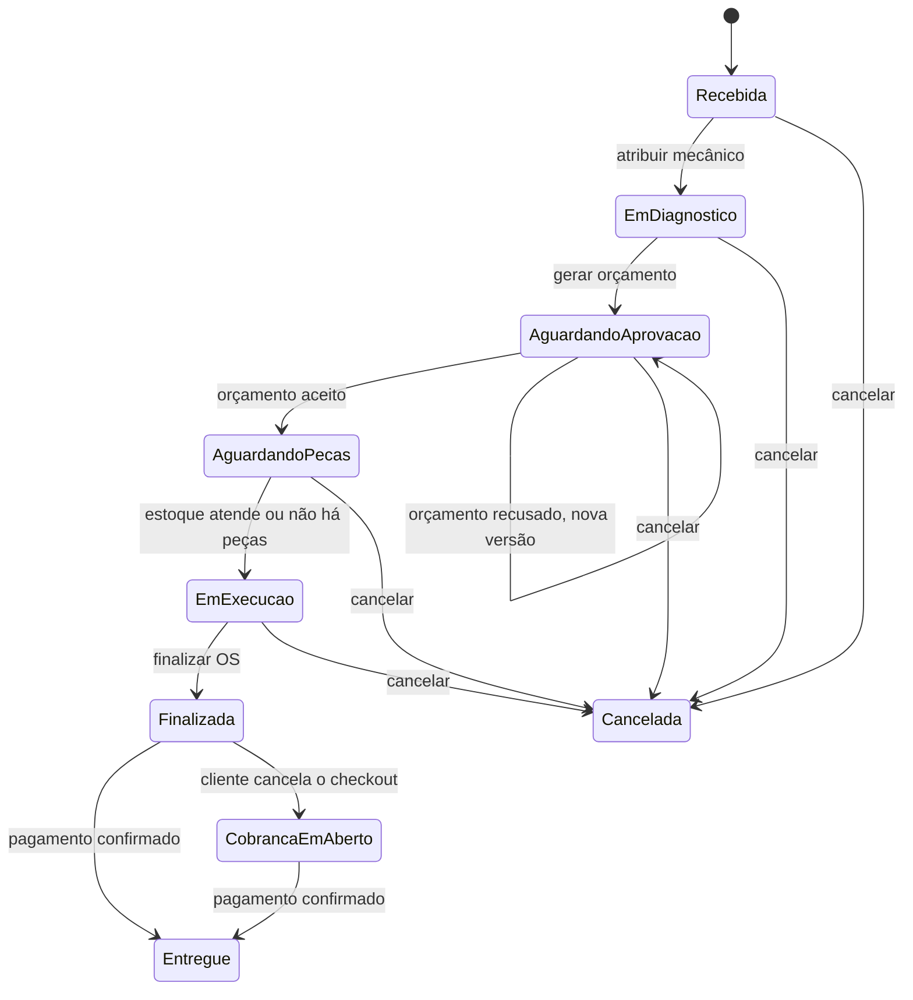

# Linguagem Ubíqua - Oficina Mecânica

## 1. Objetivo

Este documento define **o que cada termo do negócio significa** no Sistema
Integrado de Atendimento e Execução de Serviços de uma oficina mecânica, e como
esses termos se relacionam. É a referência de quem quer entender o domínio —
negócio, produto, arquitetura, desenvolvimento, testes e documentação da API
falam a partir daqui, e não é preciso ler código para acompanhar.

A linguagem de negócio é mantida em português. O código usa nomes em inglês, e
por isso cada termo aparece aqui junto do identificador que o representa no
código — é o que permite conferir se conversa, board e implementação continuam
falando da mesma coisa.

O que **deriva** deste vocabulário e interessa a quem desenvolve — convenções de
nomenclatura no código, decisões de modelagem e pendências técnicas — está no
[guia-tecnico.md](guia-tecnico.md).

Fontes:

- documentação de Event Storming, modelo de domínio e Context Map;
- código do projeto `oficina-fiap-api`: entidades, estados, serviços, controladores e banco de dados.

## 2. Visão de negócio

O atendimento começa quando um **Cliente** e seu **Veículo** são identificados. Um **Atendente** abre uma **Ordem de Serviço (OS)**, inicialmente com status **Recebida**. A OS é atribuída a um **Mecânico**, que inicia o diagnóstico e registra o resultado.

Com o diagnóstico concluído, a oficina gera um **Orçamento** com serviços e, quando necessário, peças. O orçamento é enviado ao cliente e aguarda aprovação. Se o cliente recusar, o atendimento não se encerra: a OS continua aguardando aprovação e a oficina envia uma nova versão da proposta. Quando aprovado, as peças e os insumos são solicitados ao **Estoque**. Se houver disponibilidade, o estoque é baixado e a OS entra em execução. Se houver falta, é registrada uma **Necessidade de Compra**, que origina um **Pedido de Compra**.

Após o recebimento do Pedido de Compra, o estoque é atualizado. Quando todas as peças necessárias são atendidas, a OS pode seguir para execução. Ao terminar o reparo, a OS é finalizada. Em seguida, é criada uma **Cobrança** com base no orçamento aprovado mais recente. O cliente recebe um **Link de Pagamento**; o **Gateway de Pagamento** confirma ou não o pagamento. Somente após a confirmação a OS pode ser entregue ao cliente.

## 3. Termos canônicos

| Termo canônico | Definição no domínio | Identificador no código | Não confundir com |
|---|---|---|---|
| Cliente | Pessoa física ou jurídica que solicita o atendimento e é responsável pelo veículo e pela aprovação do orçamento. | `Client` | usuário autenticado ou mecânico |
| Documento | CPF ou CNPJ do cliente, validado e persistido sem máscara. | `Document` / `document` | número da OS |
| Veículo | Automóvel vinculado a um cliente, identificado por sua placa. | `Vehicle` | peça |
| Placa | Identificador do veículo, nos formatos antigo ou Mercosul, normalizado. | `Plate` / `plate` | código da peça |
| Ordem de Serviço (OS) | Registro do atendimento de um cliente para um veículo, com diagnóstico, execução e acompanhamento de status. | `ServiceOrder` | pedido de compra |
| Mecânico | Ator responsável pela execução do diagnóstico e do serviço. | `mechanicId` | usuário autenticado; no código é armazenado apenas o identificador |
| Atendente | Ator que realiza cadastro, abertura e acompanhamento administrativo da OS. | `ADMIN` ou `EMPLOYEE` | cliente |
| Estoquista | Pessoa da área de estoque que recebe por e-mail a solicitação de peças de uma OS. Não acessa o sistema e não tem perfil de acesso (§4.3). | `STOCK_NOTIFICATION_EMAIL` | o contexto Estoque e Compras, que é parte do sistema |
| Diagnóstico | Avaliação técnica do veículo que orienta os serviços e as peças do orçamento. | conceito do domínio; ainda não há agregado próprio | orçamento |
| Orçamento | Proposta de serviços e peças, vinculada a uma OS, com total calculado e resposta do cliente. | `Budget` | cobrança |
| Versão do orçamento | Número sequencial de uma nova proposta para a mesma OS. | `version` | revisão técnica sem nova proposta |
| Item de orçamento | Serviço ou peça/insumo que compõe o orçamento. | `BudgetItem` | item do pedido de compra |
| Serviço | Trabalho que a oficina sabe executar, com nome e preço de tabela. É catálogo, não execução. | `Service` | Ordem de Serviço, que é o atendimento |
| Item de serviço | O serviço já escolhido e precificado dentro de um orçamento. Descrição e preço são cópia do catálogo no momento da proposta. | `BudgetItemType.SERVICE` | serviço do catálogo |
| Peça e insumo | Material necessário para executar o serviço e que pode ser controlado pelo estoque. | `Part`, `PartType.PART` ou `PartType.SUPPLY` | item de serviço |
| Estoque | Conjunto de peças e insumos disponíveis para atender OS e registrar reposições. | módulo `stock` | almoxarifado externo |
| Disponibilidade | Quantidade existente de uma peça ou insumo em relação à quantidade necessária. | `hasAvailability` | orçamento aprovado |
| Movimentação de estoque | Entrada ou saída registrada para alterar a quantidade disponível. Existe como registro de persistência (`StockMovement`) e não como entidade rica: quem protege o saldo é a `Part`. | `StockMovement`, `StockMovementType.IN` ou `StockMovementType.OUT` | pedido de compra |
| Necessidade de compra | Situação em que a quantidade disponível não atende a necessidade da OS. | `registerShortage` | compra já realizada |
| Pedido de Compra | Solicitação de reposição feita a um fornecedor, com seus itens e quantidades. | `PurchaseOrder` | ordem de serviço |
| Item do pedido de compra | Peça, quantidade e preço unitário copiado no momento da compra. | `PurchaseOrderItem` | item de orçamento |
| Cobrança | Valor a receber pela OS finalizada, originado do orçamento aprovado. | `Billing` | pagamento ou link de pagamento |
| Pagamento | Confirmação de que a cobrança foi quitada, normalmente recebida pelo gateway. | dados de pagamento dentro de `Billing` | cobrança pendente |
| Gateway de Pagamento | Sistema externo responsável por criar o link e informar o resultado do pagamento. | `PaymentGateway` / Stripe | notificação por e-mail |
| Link de Pagamento | Endereço gerado pelo gateway para o cliente pagar a cobrança. | `paymentLink` | confirmação de pagamento |
| Multa | Valor adicional calculado quando o link de pagamento expira e há atraso. | `Penalty` | desconto ou taxa de serviço |
| Notificação | Registro e tentativa de envio de um aviso por e-mail. | `Notification` | evento de domínio |
| Usuário | Credencial que opera o sistema, com perfil de administrador ou funcionário. | `User` | cliente da oficina |
| Sessão de atualização | Registro do refresh token emitido, usado para rotacionar e revogar acesso. | `RefreshSession` | sessão HTTP |

## 4. Contextos delimitados

### 4.1 Atendimento

**Classificação:** domínio auxiliar.

Responsável pelos dados cadastrais de clientes e veículos.

Termos principais:

- Cliente;
- Documento;
- E-mail;
- Telefone;
- Veículo;
- Placa;
- Marca, modelo e ano.

Responsabilidades:

- cadastrar, consultar, atualizar e excluir clientes;
- cadastrar, consultar, atualizar e excluir veículos;
- garantir que o veículo pertença ao cliente informado;
- fornecer `clientId` e `vehicleId` para o contexto de Gestão de Ordem de Serviço.

### 4.2 Gestão de Ordem de Serviço

**Classificação:** domínio principal.

É o contexto central do negócio. Coordena a jornada da OS, do recebimento à entrega, incluindo diagnóstico, orçamento, aprovação, execução e acompanhamento.

Termos principais:

- Ordem de Serviço;
- Diagnóstico;
- Mecânico;
- Serviço do catálogo;
- Orçamento;
- Item de orçamento;
- Aprovação e recusa;
- Execução;
- Finalização;
- Entrega.

Este contexto consulta o Atendimento, solicita disponibilidade e baixa ao Estoque e Compras, e solicita cobrança ao contexto de Pagamentos.

### 4.3 Estoque e Compras

**Classificação:** domínio auxiliar.

Responsável por peças, insumos, disponibilidade, entradas, saídas e reposição.

Termos principais:

- Peça e insumo;
- Quantidade disponível;
- Movimentação de estoque;
- Entrada;
- Saída;
- Necessidade de compra;
- Pedido de Compra;
- Entrega do Pedido de Compra.

Uma baixa de estoque para uma OS deve ser idempotente: repetir a mesma solicitação não pode retirar a mesma peça duas vezes.

**O Estoquista é um ator externo, não um usuário do sistema.** Vale a distinção
porque "Estoque e Compras" nomeia este contexto, que é parte do sistema, enquanto
o Estoquista é a pessoa que trabalha na área — os dois nomes se parecem e
significam coisas diferentes.

Quando um orçamento é aceito e faltam peças, o sistema envia um e-mail à área de
estoque com a solicitação. Esse é o único ponto de contato: o destinatário é um
endereço configurado, não um usuário cadastrado, e não existe perfil de acesso
para ele — os perfis são apenas Administrador e Funcionário. Quem registra a
entrada da peça e a entrega do Pedido de Compra no sistema é o Atendente.

A consequência é que o Estoquista aparece **fora** da fronteira nos diagramas C4:
ele recebe informação do sistema, mas não opera o sistema. Se um dia a oficina
quiser que ele mesmo dê entrada no estoque, isso deixa de ser verdade e passa a
exigir um perfil de acesso próprio.

### 4.4 Pagamentos

**Classificação:** domínio genérico.

Responsável por cobrança, link de pagamento, confirmação de pagamento, expiração e multa.

Termos principais:

- Cobrança;
- Valor da cobrança;
- Link de Pagamento;
- Gateway de Pagamento;
- Pagamento registrado;
- Cobrança expirada;
- Multa.

Uma cobrança só pode ser criada para uma OS finalizada e deve utilizar o orçamento aprovado mais recente.

### 4.5 Autenticação e Acesso

**Classificação:** domínio genérico.

Responsável por usuários, credenciais, perfis, permissões, tokens e sessões de atualização.

Termos principais:

- Usuário;
- Credencial;
- Administrador;
- Funcionário;
- Access token;
- Refresh token;
- Sessão de atualização.

Este contexto autentica e autoriza as operações administrativas dos demais contextos.

### 4.6 Notificações

No Context Map original, a notificação aparece como capacidade de apoio associada aos demais contextos. No código ela existe como módulo próprio e transversal.

Tipos implementados:

- orçamento pronto para aprovação (`BUDGET_READY`);
- link de pagamento disponível (`PAYMENT_LINK_READY`);
- peças e insumos solicitados (`STOCK_PARTS_REQUESTED`).

Falha no envio não desfaz a operação de negócio. A notificação fica registrada como `FAILED` e pode ser reenviada por um operador.

## 5. Agregados e limites de consistência

| Agregado | Raiz | Conteúdo principal | Invariantes relevantes |
|---|---|---|---|
| Cliente | `Client` | dados cadastrais e VOs `Document` e `Email` | documento e e-mail únicos; telefone válido; documento imutável |
| Veículo | `Vehicle` | veículo e VOs `Plate` e `ModelYear` | placa e cliente obrigatórios; placa e proprietário imutáveis |
| Ordem de Serviço | `ServiceOrder` | cliente, veículo, descrição, mecânico, status e marcos de execução | transições válidas; mecânico obrigatório para execução; motivo obrigatório ao cancelar |
| Orçamento | `Budget` | versão, itens, total e resposta do cliente | pelo menos um item; total calculado pelo sistema; só orçamento em `GERADO` pode ser editado; só em `AGUARDANDO_APROVAÇÃO` pode ser respondido |
| Serviço do catálogo | `Service` | nome, descrição e preço de tabela | nome único e obrigatório; preço maior que zero |
| Peça | `Part` | peça/insumo, código, preço, quantidade e quantidade mínima | código único; quantidade não pode ficar negativa; movimentação inteira e positiva; baixa idempotente |
| Pedido de Compra | `PurchaseOrder` | fornecedor, número, status e `PurchaseOrderItem` | precisa ter itens para registrar a compra; itens não mudam após o registro |
| Cobrança | `Billing` | OS, orçamento, valor, link, transação, status e pagamento | valor positivo; pagamento idempotente; cobrança paga é terminal |

### Relações entre agregados

- Cliente possui zero ou mais Veículos.
- Cliente e Veículo são referências obrigatórias de uma Ordem de Serviço.
- Uma Ordem de Serviço pode possuir várias versões de Orçamento.
- Um Orçamento possui um ou mais Itens de Orçamento.
- Item de Orçamento do tipo peça referencia uma Peça; do tipo serviço, um Serviço do catálogo. Em ambos os casos, descrição e preço são **cópia** do momento da proposta: reajustar o cadastro depois não altera orçamento já acordado.
- Um Pedido de Compra possui um ou mais Itens do Pedido.
- Uma Cobrança referencia uma OS e o Orçamento que fundamentou o valor.
- A OS não incorpora os demais agregados; utiliza seus identificadores e serviços de aplicação.

## 6. Comandos e eventos de negócio

Os comandos representam intenção. Os eventos representam fatos já ocorridos e devem ser nomeados no passado. Os diagramas usam esses conceitos explicitamente; a implementação atual orquestra as ações por serviços e controladores, sem um barramento de eventos de domínio.

### 6.1 Atendimento

| Comando | Evento resultante |
|---|---|
| Consultar cliente | Cliente encontrado ou Cliente não encontrado |
| Cadastrar cliente | Cliente cadastrado |
| Consultar veículo | Veículo encontrado ou Veículo não encontrado |
| Cadastrar veículo | Veículo cadastrado |

### 6.2 Ordem de Serviço e Orçamento

| Comando | Evento resultante |
|---|---|
| Cadastrar serviço no catálogo | Serviço disponível para compor orçamentos |
| Criar Ordem de Serviço | Ordem de Serviço criada com status Recebida |
| Atribuir OS ao mecânico | OS atribuída ao mecânico; diagnóstico iniciado |
| Finalizar diagnóstico | Diagnóstico realizado; diagnóstico registrado |
| Gerar orçamento | Orçamento gerado |
| Enviar orçamento ao cliente | Orçamento aguardando aprovação; notificação de orçamento enviada |
| Aceitar orçamento | Orçamento aceito; peças solicitadas |
| Recusar orçamento | Orçamento recusado; a OS **permanece** em Aguardando aprovação |
| Consultar OS | Status atual da Ordem de Serviço consultado |
| Cancelar OS | Ordem de Serviço cancelada |
| Finalizar OS | Ordem de Serviço finalizada |

### 6.3 Estoque e Compras

| Comando | Evento resultante |
|---|---|
| Consultar disponibilidade das peças | Peças e insumos disponíveis ou Peças e insumos indisponíveis |
| Baixar peças para a OS | Movimentação de saída registrada; estoque atualizado |
| Registrar necessidade de compra | Necessidade de compra identificada; Pedido de Compra registrado |
| Registrar compra | Pedido de Compra aguardando entrega |
| Registrar entrega do Pedido de Compra | Pedido de Compra recebido; movimentação de entrada registrada; estoque atualizado |
| Reprocessar despacho da OS | Peças despachadas ou nova necessidade de compra identificada |

### 6.4 Pagamentos e notificações

| Comando | Evento resultante |
|---|---|
| Gerar cobrança | Cobrança gerada |
| Gerar ou renovar link | Link de pagamento disponibilizado |
| Registrar pagamento | Pagamento registrado |
| Expirar cobrança | Cobrança expirada; multa calculável |
| Entregar OS após pagamento | Ordem de Serviço entregue |
| Enviar notificação | Cliente ou estoque notificado |
| Reenviar notificação com falha | Notificação reenviada ou falha novamente registrada |

## 7. Estados do domínio

### 7.1 Ordem de Serviço

Estados técnicos:

| Estado de negócio | Enum |
|---|---|
| Recebida | `RECEIVED` |
| Em diagnóstico | `IN_DIAGNOSIS` |
| Aguardando aprovação | `AWAITING_APPROVAL` |
| Aguardando peças | `AWAITING_PARTS` |
| Em execução | `IN_PROGRESS` |
| Finalizada | `COMPLETED` |
| Cobrança em aberto | `AWAITING_PAYMENT` |
| Entregue | `DELIVERED` |
| Cancelada | `CANCELLED` |

`AWAITING_PAYMENT` é o retorno de cancelamento do checkout: o serviço está pronto, a cobrança continua de pé e a OS fica retida até o pagamento entrar. A única saída dele é a entrega.

O tempo médio de execução é medido da atribuição ao mecânico (`assignedAt`) até a finalização (`completedAt`), e não da abertura da OS.

### 7.2 Orçamento

`GERADO` (`GENERATED`) -> `AGUARDANDO_APROVAÇÃO` (`WAITING_APPROVAL`) -> `ACEITO` (`ACCEPTED`) ou `RECUSADO` (`REFUSED`).

Somente o orçamento em estado `GERADO` pode receber ou remover itens. Somente o orçamento em `AGUARDANDO_APROVAÇÃO` pode ser aceito ou recusado. A recusa exige motivo.

A recusa é terminal **para aquela versão**, não para a OS: a oficina gera uma nova versão do orçamento para a mesma Ordem de Serviço e envia de novo. Não há limite de versões.

### 7.3 Cobrança

`PENDENTE` (`PENDING`) -> `AGUARDANDO_PAGAMENTO` (`WAITING_PAYMENT`) -> `PAGA` (`PAID`).

Uma cobrança `PENDENTE` ou `AGUARDANDO_PAGAMENTO` pode tornar-se `EXPIRADA` (`EXPIRED`). Uma cobrança paga é terminal. O pagamento deve ser idempotente para a mesma transação do gateway.

### 7.4 Pedido de Compra

`NECESSITA_COMPRA` (`NEEDS_PURCHASE`) -> `AGUARDANDO_ENTREGA` (`AWAITING_DELIVERY`) -> `ENTREGUE` (`DELIVERED`).

Quando o Pedido de Compra é entregue, cada item gera uma entrada no estoque, com chave de idempotência derivada do pedido e do item — reentregar o mesmo pedido não soma duas vezes.

### 7.5 Notificação

`PENDENTE` (`PENDING`) -> `ENVIADA` (`SENT`) ou `FALHOU` (`FAILED`). Somente uma notificação que falhou pode ser reenviada explicitamente.

## 8. Regras de negócio

1. Uma OS deve referenciar um cliente existente e um veículo pertencente a esse cliente.
2. Ao atribuir uma OS, o status passa para `Em diagnóstico`, o mecânico é registrado e o cronômetro é iniciado.
3. Um mecânico não pode possuir outra OS aberta simultaneamente.
4. Uma OS só entra em `Em execução` depois que o estoque registra o atendimento das peças. A exceção é um orçamento composto somente por serviços, que não exige baixa de estoque.
5. O orçamento deve conter pelo menos um item e seu total é calculado pelo sistema.
6. Um item de orçamento do tipo peça referencia obrigatoriamente uma peça do estoque, e um item do tipo serviço não referencia peça alguma (a referência ao serviço do catálogo, essa sim, é opcional — existe serviço avulso). A peça referenciada precisa existir de verdade. A exigência vale **na montagem do orçamento**, não no despacho: antes ela só era cobrada na baixa de estoque, e um item de peça sem peça atravessava a proposta inteira para travar depois, com a OS já aguardando peças e o cliente já tendo aceitado.
7. Quando o primeiro orçamento é gerado, a OS passa a `Aguardando aprovação` e o cliente é notificado.
8. Quando o cliente aceita o orçamento, a OS passa a `Aguardando peças` e o estoque é notificado.
9. Quando o cliente recusa o orçamento, a OS **continua** em `Aguardando aprovação` e o mecânico pode gerar uma nova versão da proposta. Recusa é resposta a uma proposta, não desistência do atendimento — o cliente achar caro a primeira versão é o caso comum. Encerrar a OS é decisão manual de quem atende, pelo comando `Cancelar OS`, que exige motivo.
10. Para o estoque e para a cobrança, vale o orçamento aceito de maior versão.
11. Se a disponibilidade for insuficiente, o sistema deve registrar a necessidade de compra com a diferença necessária.
12. A entrada de estoque originada de reposição só acontece depois que o Pedido de Compra é registrado como entregue, e usa chave de idempotência derivada do pedido e do item. Isso não impede a entrada avulsa, registrada diretamente como Movimentação de estoque — é como o saldo inicial de uma peça recém-cadastrada é lançado, já que a peça nasce com quantidade zero.
13. Uma cobrança só pode ser criada para uma OS finalizada e com orçamento aceito.
14. O valor da cobrança é o total do orçamento aceito; o cliente não informa um total calculado manualmente.
15. A OS só pode ser entregue após a cobrança estar paga.
16. Falhas de e-mail não revertem orçamento, aprovação, baixa de estoque, cobrança ou pagamento.
17. Quantidades de movimentação de estoque devem ser inteiras e positivas.
18. A quantidade disponível de uma peça não pode ficar negativa.
19. Uma peça precisa ser reposta quando sua quantidade disponível for menor ou igual à quantidade mínima configurada.
20. Documento e e-mail do cliente, placa do veículo, código da peça, nome do serviço do catálogo, número do Pedido de Compra, chave de idempotência de movimentação e identificador de transação do gateway são únicos no sistema.

## 9. Value Objects e conceitos imutáveis

| Conceito | Regra |
|---|---|
| `Document` | valida o documento nos formatos CPF ou CNPJ e normaliza para somente dígitos |
| `Email` | valida e normaliza para minúsculas |
| `Plate` | valida placa antiga ou Mercosul e normaliza o formato |
| `ModelYear` | aceita ano entre 1900 e o ano seguinte ao atual |
| `PartCode` | identifica unicamente uma peça ou insumo; normaliza para maiúsculas e aceita apenas letras, números, ponto, hífen e sublinhado |
| `Quantity` | quantidade inteira de peça ou insumo. Tem dois construtores porque o domínio tem duas invariantes: `create` para **saldo**, que pode ser zero (regra 18), e `positive` para **movimento**, que não pode (regra 17) |
| `Money` | valor monetário em centavos inteiros, evitando erro de arredondamento de ponto flutuante. É a única forma que o domínio conhece: decimal existe só no contrato HTTP e centavos só no banco |
| `PurchaseOrderNumber` | identifica o Pedido de Compra, no formato sequencial anual, por exemplo `PC-2026-0001` |
| `Penalty` | calcula o valor adicional de uma cobrança vencida |

## 10. Mapeamento entre contexto, módulo e API

O prefixo de API nomeia o **agregado**, sempre no plural. Ele não repete o nome
do contexto: por isso o recurso de peça é `/api/v1/parts`, e não `/api/v1/stock`.
Estoque é o contexto; Peça é o agregado que se cadastra e consulta.

| Contexto | Módulo | Agregado/entidade principal | Prefixo de API |
|---|---|---|---|
| Atendimento | `client` | `Client` | `/api/v1/clients` |
| Atendimento | `vehicle` | `Vehicle` | `/api/v1/vehicles` |
| Gestão de OS | `service-order` | `ServiceOrder` | `/api/v1/service-orders` |
| Gestão de OS | `budget` | `Budget` | `/api/v1/budgets` |
| Gestão de OS | `service-catalog` | `Service` | `/api/v1/services` |
| Estoque e Compras | `stock` | `Part` e `StockMovement` | `/api/v1/parts` |
| Estoque e Compras | `purchase-order` | `PurchaseOrder` | `/api/v1/purchase-orders` |
| Pagamentos | `billing` | `Billing` | `/api/v1/billings` |
| Autenticação e Acesso | `auth` e `shared/identity` | `User` e `RefreshSession` | `/api/v1/auth` |
| Notificações | `notification` | `Notification` | `/api/v1/notifications` |

A entrada e a saída de estoque são **Movimentação de estoque**, não um recurso
"stock" dentro da peça: `POST /api/v1/parts/:id/movements/in` e
`POST /api/v1/parts/:id/movements/out`.
