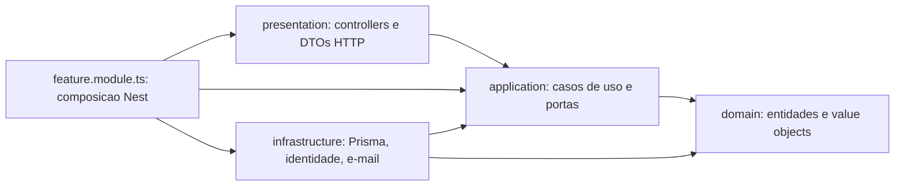

# Migracao para Clean Architecture

Na Fase 1 o projeto foi organizado em camadas dentro de cada modulo (`controllers/`, `services/`, `repositories/`, `entities/`), como descrito no [guia tecnico](guia-tecnico.md#arquitetura). Na Fase 2 os modulos estao sendo migrados, um de cada vez, para Clean Architecture. Esta pagina explica a regra comum a todos e aponta para a pagina de cada modulo migrado.

## A regra que importa: direcao das dependencias

Pastas e nomes ajudam a ler o codigo, mas o que define Clean Architecture e **para onde os imports apontam**. As regras de negocio ficam no centro e nao conhecem nada de fora:

As setas sao imports de codigo, nao a ordem de uma requisicao.

- `domain/` nao importa nada de `application/`, `presentation/` ou `infrastructure/`, nem Nest, Prisma, Swagger, request ou response. So `shared/domain` e a biblioteca padrao do Node.
- `application/` importa o proprio dominio e os seus contratos. Nao importa DTO decorado, controller, Prisma, SDK, modulo Nest nem configuracao de bootstrap.
- `presentation/` valida o contrato HTTP, chama o caso de uso, serializa o resultado e traduz erros em status.
- `infrastructure/` implementa as portas e esconde a tecnologia (Prisma, hash de senha, e-mail).
- `<feature>.module.ts` e o unico lugar que conhece todas as camadas: e onde cada porta recebe a sua implementacao.

## Layout de um modulo migrado

| Diretorio                     | Responsabilidade                                                          |
| ----------------------------- | ------------------------------------------------------------------------- |
| `domain/entities/`            | Entidade com invariantes e comportamento                                  |
| `domain/value-objects/`       | Valores com regra propria (`*.vo.ts`)                                     |
| `application/use-cases/`      | Um caso de uso por acao, classe pura com `execute()`                      |
| `application/ports/`          | Contratos que a aplicacao exige da infraestrutura                         |
| `application/contracts/`      | Inputs e resultados tipados, sem decorators                               |
| `application/errors/`         | Erros de aplicacao com codigo estavel, traduzidos na borda HTTP           |
| `infrastructure/persistence/` | Implementacao Prisma da porta de repositorio e mapper de persistencia     |
| `infrastructure/<outros>/`    | Adapters para subsistemas compartilhados (identidade, e-mail, pagamento)  |
| `presentation/http/`          | Controller, DTOs, mapper de resposta e filtro de erro                     |
| `<feature>.module.ts`         | Composicao Nest: liga cada porta a sua implementacao                      |

Subpastas so existem quando tem responsabilidade concreta. Casos de uso sao testados com `new UseCase(fakePort)`, sem `Test.createTestingModule`.

## Base compartilhada da migracao

Tres pecas valem para todos os modulos e moram fora deles:

| Onde | O que |
| --- | --- |
| `src/shared/application/application.error.ts` | `ApplicationError`, base abstrata com `code`, `kind` (`NOT_FOUND`, `CONFLICT`, `GONE`, `INVALID`, `UNAUTHORIZED`, `FORBIDDEN`) e mensagem. Cada modulo tem a sua subclasse, por exemplo `ClientApplicationError`, com os proprios codigos. |
| `src/shared/http/filters/application-exception.filter.ts` | Unico filtro HTTP para erros de aplicacao. Traduz `kind` em status e mantem o envelope `{ statusCode, message, error }`. Nenhum modulo registra filtro proprio. |
| `src/shared/application/logger.port.ts` | `LoggerPort`, para casos de uso que precisam registrar erro sem conhecer o logger do framework. Implementada por `src/shared/infrastructure/logging/nest-logger.adapter.ts`. |
| `src/architecture.spec.ts` + `test/architecture/` | Teste de fronteira: para cada modulo em `migrated-modules.ts`, resolve todo import de `domain/` e `application/` (inclusive `import type`, `require`, `import()` e aliases) e falha se apontar para Nest, Prisma, outro modulo, `presentation/` ou `infrastructure/`. Tambem monta o grafo entre `*.module.ts` e acusa ciclos e uso de `forwardRef`. |

O `kind` e uma categoria de negocio, nao um status HTTP. O caso de uso diz o que aconteceu; quem decide 404, 409 ou 410 e o filtro na borda. Isso permite que outro modulo, ou um adapter, reaja ao erro pelo `code` sem conhecer HTTP.

### Regra de imports por camada

| Camada | Pode importar |
| --- | --- |
| `domain/` | o proprio `domain/`, `src/shared/domain` |
| `application/` | o de cima, o proprio `application/`, `src/shared/application`, `node:crypto` |
| `infrastructure/` e `presentation/` | qualquer coisa, inclusive casos de uso exportados por outros modulos |

`application/` nunca importa outro modulo, nem o `application/` dele. Quando um caso de uso precisa de outro modulo, declara uma porta em `application/ports/` e o adapter em `infrastructure/integrations/` faz a ligacao.

## Modulos

| Modulo          | Situacao            | Pagina                                                  |
| --------------- | ------------------- | ------------------------------------------------------- |
| Client          | migrado             | [Modulo Client](clean-architecture/modulo-client.md)    |
| Vehicle         | migrado             | [Modulo Vehicle](clean-architecture/modulo-vehicle.md)  |
| Service Catalog | migrado             | [Modulo Service Catalog](clean-architecture/modulo-service-catalog.md) |
| Parts Dispatch  | novo, migrado       | [Modulo Parts Dispatch](clean-architecture/modulo-parts-dispatch.md) |
| Stock           | migrado             | [Modulo Stock](clean-architecture/modulo-stock.md)      |
| Service Order   | migrado             | [Modulo Service Order](clean-architecture/modulo-service-order.md) |
| Budget          | migrado             | [Modulo Budget](clean-architecture/modulo-budget.md)    |
| Purchase Order  | migrado             | [Modulo Purchase Order](clean-architecture/modulo-purchase-order.md) |
| Billing         | migrado             | [Modulo Billing](clean-architecture/modulo-billing.md)  |
| Notification    | migrado             | [Modulo Notification](clean-architecture/modulo-notification.md) |
| Auth            | layout legado       | —                                                       |

Durante a transicao, um modulo migrado exporta so casos de uso; os modulos legados que dependem dele injetam esses casos de uso diretamente, nunca a implementacao Prisma nem o controller. Um modulo migrado que depende de um legado declara uma porta e o adapter chama o service legado, trocado pelo caso de uso quando o fornecedor migrar. Contratos HTTP, schema e migrations nao mudam na migracao.
