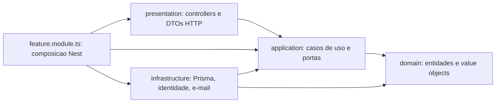

# Migracao para Clean Architecture

Na Fase 1 o projeto foi organizado em camadas dentro de cada modulo (`controllers/`, `services/`, `repositories/`, `entities/`), como descrito no [guia tecnico](guia-tecnico.md#arquitetura). Na Fase 2 os modulos estao sendo migrados, um de cada vez, para Clean Architecture. Esta pagina explica a regra comum a todos e aponta para a pagina de cada modulo migrado.

## A regra que importa: direcao das dependencias

Pastas e nomes ajudam a ler o codigo, mas o que define Clean Architecture e **para onde os imports apontam**. As regras de negocio ficam no centro e nao conhecem nada de fora:

As setas sao imports de codigo, nao a ordem de uma requisicao.

- `domain/` nao importa nada de `application/`, `presentation/` ou `infrastructure/`, nem Nest, Prisma, Swagger, request ou response. So `shared/domain` e a biblioteca padrao do Node.
- `application/` importa o proprio dominio e os seus contratos. Nao importa DTO decorado, controller, Prisma, SDK, modulo Nest nem configuracao de bootstrap.
- `presentation/` valida o contrato HTTP, chama o caso de uso, serializa o resultado e traduz erros em status.
- `infrastructure/` implementa as portas e esconde a tecnologia (Prisma, hash de senha, e-mail).
- `<feature>.module.ts` e o unico lugar que conhece todas as camadas: e onde cada porta recebe a sua implementacao.

## Layout de um modulo migrado

| Diretorio                     | Responsabilidade                                                          |
| ----------------------------- | ------------------------------------------------------------------------- |
| `domain/entities/`            | Entidade com invariantes e comportamento                                  |
| `domain/value-objects/`       | Valores com regra propria (`*.vo.ts`)                                     |
| `application/use-cases/`      | Um caso de uso por acao, classe pura com `execute()`                      |
| `application/ports/`          | Contratos que a aplicacao exige da infraestrutura                         |
| `application/contracts/`      | Inputs e resultados tipados, sem decorators                               |
| `application/errors/`         | Erros de aplicacao com codigo estavel, traduzidos na borda HTTP           |
| `infrastructure/persistence/` | Implementacao Prisma da porta de repositorio e mapper de persistencia     |
| `infrastructure/<outros>/`    | Adapters para subsistemas compartilhados (identidade, e-mail, pagamento)  |
| `presentation/http/`          | Controller, DTOs, mapper de resposta e filtro de erro                     |
| `<feature>.module.ts`         | Composicao Nest: liga cada porta a sua implementacao                      |

Subpastas so existem quando tem responsabilidade concreta. Casos de uso sao testados com `new UseCase(fakePort)`, sem `Test.createTestingModule`. Um teste de fronteira por modulo resolve todos os imports de `domain/` e `application/` e falha se algum apontar para fora do permitido.

## Modulos

| Modulo          | Situacao            | Pagina                                                  |
| --------------- | ------------------- | ------------------------------------------------------- |
| Client          | migrado             | [Modulo Client](clean-architecture/modulo-client.md)    |
| Vehicle         | layout legado       | —                                                       |
| Service Catalog | layout legado       | —                                                       |
| Stock           | layout legado       | —                                                       |
| Service Order   | layout legado       | —                                                       |
| Budget          | layout legado       | —                                                       |
| Purchase Order  | layout legado       | —                                                       |
| Billing         | layout legado       | —                                                       |
| Notification    | layout legado       | —                                                       |
| Auth            | layout legado       | —                                                       |

Durante a transicao, um modulo migrado expoe casos de uso e portas; os modulos legados que dependem dele injetam esses tipos, nunca a implementacao Prisma. Contratos HTTP, schema e migrations nao mudam na migracao.
